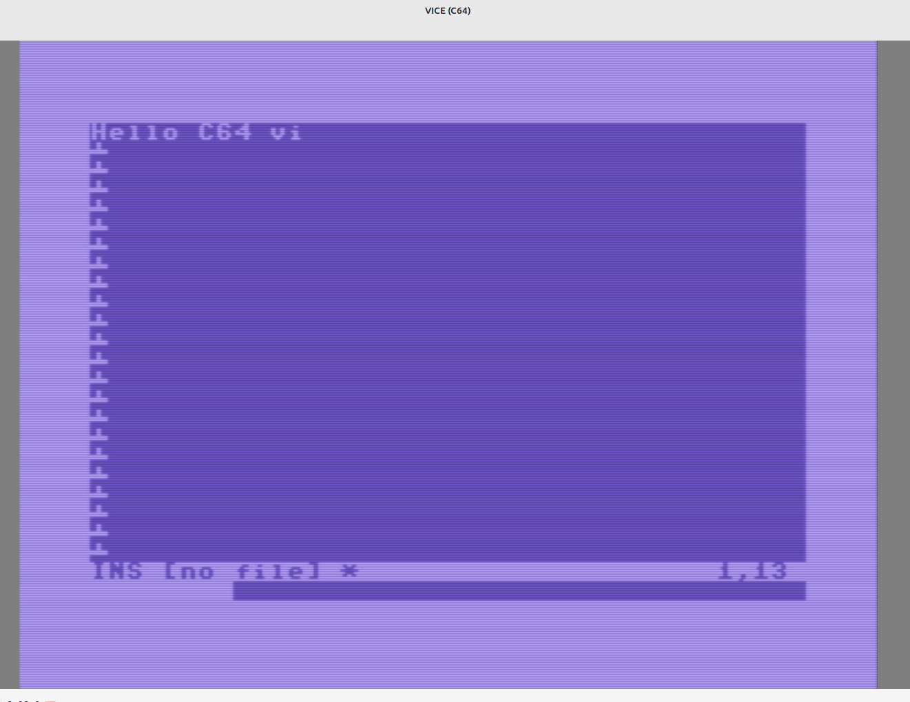

# vi editor for the Commodore 64

A minimal "Just for Fun" **[vi](https://en.wikipedia.org/wiki/Vi_(text_editor))**-style text editor for the Commodore 64, written in C and compiled
with [cc65](https://cc65.github.io/). It can open, edit, and save sequential
text files on a 1541-compatible disk drive.



## Requirements

[cc65 v2.19+](https://cc65.github.io/)  C cross-compiler for 6502 / C64 
 
[VICE](https://vice-emu.sourceforge.io/) C64 emulator (`x64sc`, `c1541`) 

-
---

## Building

Set CC65_HOME=/your/path` in the Makefile to the cc65 location.


```bash
make          # compiles vi.prg and creates vi_disk.d64
make clean    # remove build artefacts
make run      # build + launch in VICE (x64sc)
```

The disk image `vi_disk.d64` is a standard 1541 D64 formatted as
**"VI EDITOR"** with the `VI` program already written to it.

---

## Running

### In VICE
```bash
make run
```
VICE will auto-start the disk and boot the editor.

### On a real C64 (or any emulator)
1. Transfer `vi_disk.d64` to a real disk or mount it in your emulator.
2. At the BASIC prompt:
   ```
   LOAD "VI",8,1
   RUN
   ```

---

## Usage

The editor starts with an empty buffer. Use `:e` to open a file or just
start typing and use `:w` to save.

### Modes

The editor has three modes, shown in the bottom status bar:

| Indicator | Mode | Purpose |
|-----------|------|---------|
| `NOR` | **Normal** | Navigate and issue commands |
| `INS` | **Insert** | Type text |
| `CMD` | **Command** | Enter `:` commands |

### Normal mode

Press **RUN/STOP** or **F1** from Insert mode to return to Normal mode.

#### Movement

| Key | Action |
|-----|--------|
| `h` or ← | Move left |
| `l` or → | Move right |
| `k` or ↑ | Move up |
| `j` or ↓ | Move down |
| `0` or HOME | Beginning of line |
| `$` | End of line |
| `g` `g` | Go to first line |
| `G` (Shift+G) | Go to last line |

#### Editing

| Key | Action |
|-----|--------|
| `i` | Enter Insert mode **before** cursor |
| `a` | Enter Insert mode **after** cursor (append) |
| `o` | Open new line **below**, enter Insert mode |
| `O` (Shift+O) | Open new line **above**, enter Insert mode |
| `x` | Delete character under cursor |
| `d` `d` | Delete current line |

#### Command mode

| Key | Action |
|-----|--------|
| `:` | Enter Command mode |

### Insert mode

| Key | Action |
|-----|--------|
| Any printable key | Insert character at cursor |
| DEL | Delete character to the left (backspace) |
| RETURN | Split line / new line |
| ← → ↑ ↓ | Move cursor |
| **RUN/STOP** or **F1** | Return to Normal mode |

### Command mode

Type a command after the `:` prompt and press **RETURN** to execute.
Press **RUN/STOP** to cancel.

| Command | Action |
|---------|--------|
| `:w` | Save to current filename |
| `:w foo.txt` | Save to `foo.txt` (sets current filename) |
| `:wq` | Save and quit |
| `:e foo.txt` | Open `foo.txt` from disk |
| `:q` | Quit (fails if unsaved changes) |
| `:q!` | Quit without saving |

> **Filenames** - type with unshifted keys. The C64 drive stores them
> exactly as typed. A name like `notes.txt` works fine.

---

## File format

Files are stored as CBM sequential (SEQ) files, with lines separated by
PETSCII carriage-return (`0x0D`). This is the native C64 text file format,
compatible with BASIC's sequential file routines and most C64 utilities.

---


## Limitations

- Lines are capped at **79 characters** (fits the 40-column screen with margin).
- Maximum **200 lines** per file (~16 KB of text).
- No horizontal scrolling - lines longer than 40 chars are truncated on screen
  (the full content is preserved in the buffer and saved correctly).
- No undo.
- No search / replace.
- Single file open at a time.

---

